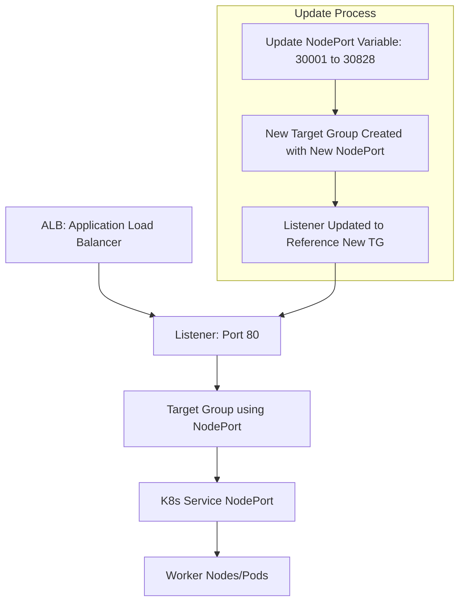

# ALB, Listener, Target group, K8S nodes

```mermaid
flowchart TD
  A[ALB: Application Load Balancer]
  B[Listener: Port 80]
  C[Target Group using NodePort]
  D[K8s Service NodePort]
  E[Worker Nodes/Pods]

  A --> B
  B --> C
  C --> D
  D --> E

  subgraph UpdateProcess [Update Process]
    F[Update NodePort Variable: 30001 to 30828]
    G[New Target Group Created with New NodePort]
    H[Listener Updated to Reference New TG]
  end

  F --> G
  G --> H
  H --> B

```